# Agency – Security Encryption Flow Diagrams

This document provides detailed sequence diagrams for each major user flow in Agency, highlighting:
- 🔐 **Encrypted data** at each step
- 🚫 **Zero-knowledge boundaries** (where servers cannot decrypt)
- 🛡️ **Security mechanisms** and privacy guarantees

---

## Table of Contents

1. [Key Management Initialization](#1-key-management--initialization)
2. [Document Ingestion - Standalone Mode](#2-document-ingestion---standalone-mode)
3. [Document Ingestion - App-Managed Storage](#3-document-ingestion---app-managed-storage)
4. [Document Ingestion - BYOS Storage](#4-document-ingestion---byos-storage)
5. [Search RAG Chat - Standalone](#5-search--rag-chat---standalone)
6. [Search RAG Chat - Cloud-Connected](#6-search--rag-chat---cloud-connected)
7. [Document Download Decryption](#7-document-download--decryption)
8. [Share Link Creation Access](#8-share-link-creation--access)
9. [Team Creation Key Distribution](#9-team-creation--key-distribution)
10. [TEE Offload/Load Flow](#10-tee-offloadload-flow)

---

## Legend

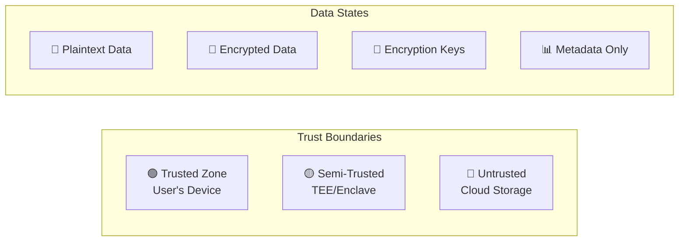

> **Zero-Knowledge Principle:** In all flows, the cloud infrastructure (Go API, Supabase, S3 storage) only sees:
> - 🔐 Encrypted blobs
> - 🔐 Encrypted filenames (hex-encoded)
> - 📊 Non-sensitive metadata (IDs, timestamps, sizes)
> - ❌ **Never** plaintext content, filenames, or decryption keys

---

## 1. Key Management Initialization

### User Master Key Generation

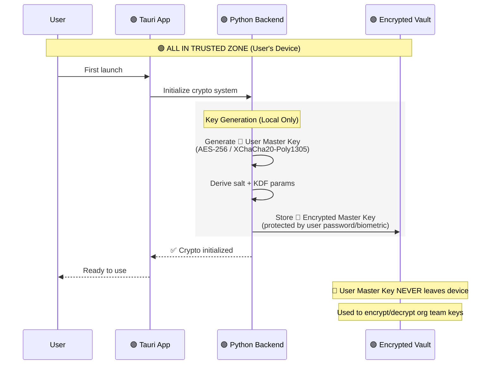

**Security Properties:**
- 🔑 User Master Key generated locally using secure random number generator
- 🔐 Protected by user password or biometric authentication
- 🚫 **Zero-Knowledge Boundary:** Master key NEVER transmitted to cloud
- 💾 Stored in encrypted local vault (filesystem encryption)

---

## 2. Document Ingestion - Standalone Mode

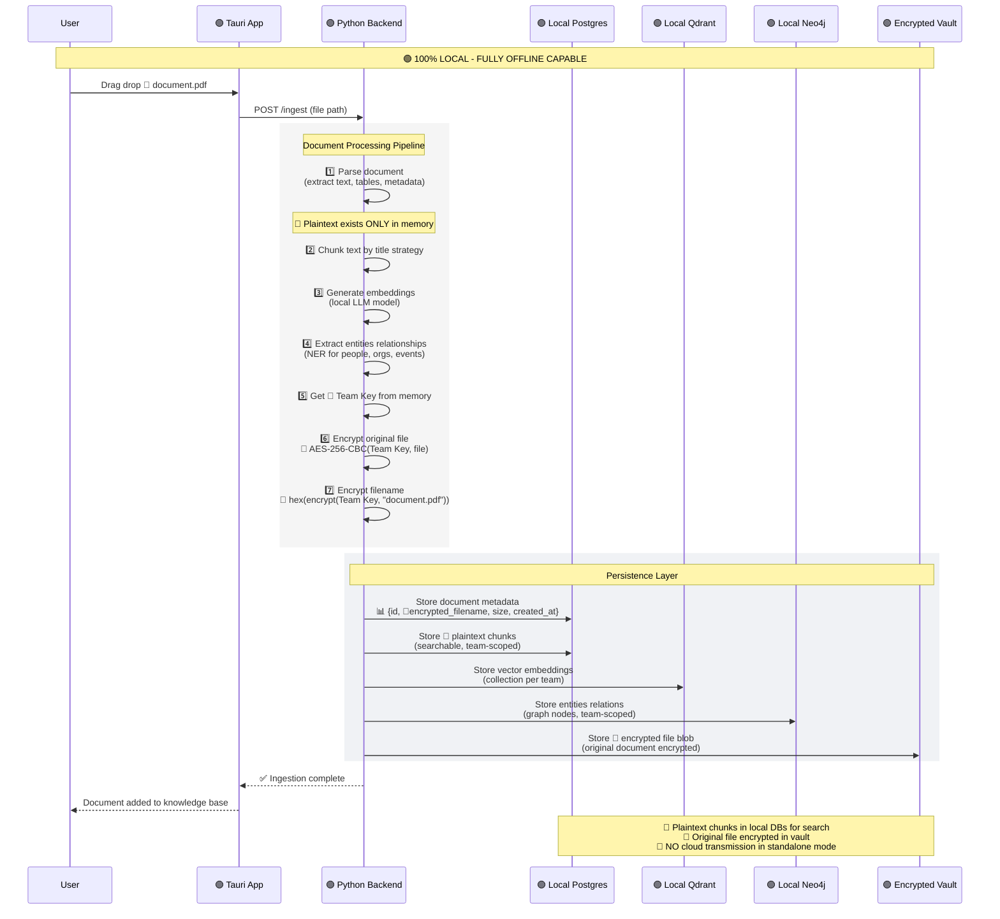

**Security Properties:**
- 📄 Plaintext exists ONLY in memory during processing
- 🔐 Original file encrypted with team key before storage
- 📄 Text chunks stored in plaintext locally for search (team-scoped)
- 🟢 All data stays on user's device
- 🚫 **Zero-Knowledge Boundary:** Not applicable (no cloud in standalone mode)
- 💾 Encrypted vault protects original files at rest

**Privacy Guarantees:**
- ✅ Fully offline capable - no network calls required
- ✅ Local search and embeddings - no data leaves device
- ✅ Multi-team isolation via local database scoping

---

## 3. Document Ingestion - App-Managed Storage

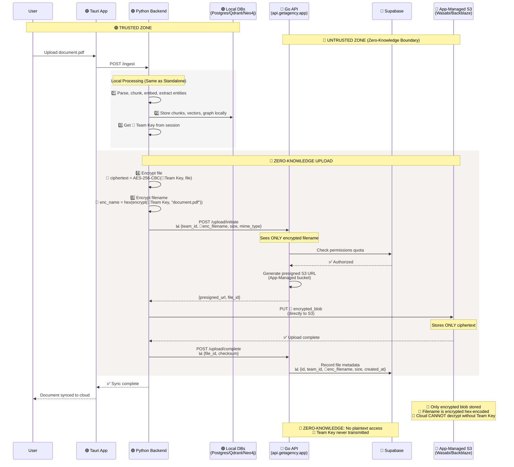

**Security Properties:**
- 🔐 File encrypted with team key BEFORE leaving device
- 🔐 Filename encrypted and hex-encoded before transmission
- 🔑 Team key NEVER sent to cloud (stays in local memory)
- 📊 Cloud sees only: encrypted blob, encrypted filename, metadata (size, timestamps)
- 🚫 **Zero-Knowledge Boundary:** Go API, Supabase, and S3 cannot decrypt content

**Data Flow:**
1. 🟢 **Trusted:** Processing and encryption on local device
2. 🔴 **Untrusted:** Encrypted upload to cloud storage
3. 🔴 **Untrusted:** Cloud stores ciphertext only

---

## 4. Document Ingestion - BYOS Storage

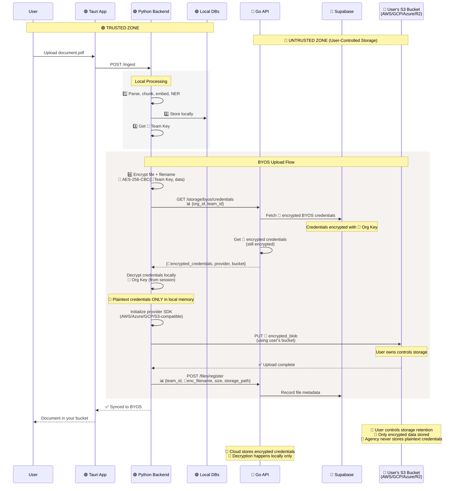

**Security Properties:**
- 🔐 File and filename encrypted before upload
- 🔑 BYOS credentials encrypted with org key in cloud
- 🔑 Credentials decrypted ONLY in local backend (never in cloud)
- 🏢 User owns and controls the storage bucket
- 🚫 **Zero-Knowledge Boundary:** Cloud API never sees plaintext credentials or file content
- 🔐 Provider SDK initialized locally with decrypted credentials

**BYOS Advantages:**
- ✅ User controls data residency and retention policies
- ✅ Direct control over storage costs and lifecycle
- ✅ Credentials protected via org key encryption
- ✅ Agency cloud never handles plaintext storage credentials

---

## 5. Search RAG Chat - Standalone

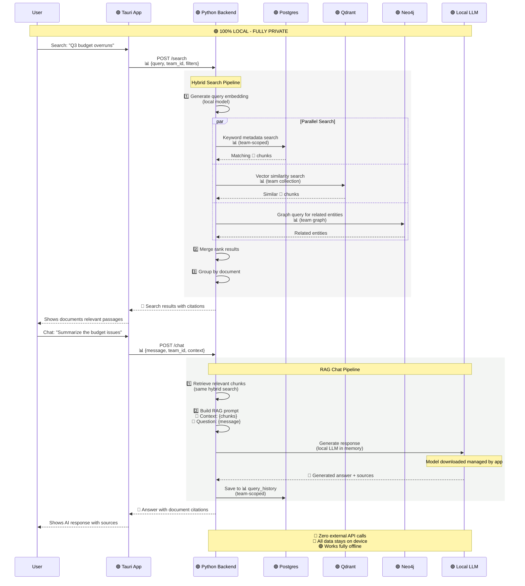

**Security Properties:**
- 🟢 All processing happens locally on user's device
- 📄 Search operates on plaintext chunks (team-scoped in local DB)
- 🤖 Local LLM model (no external AI API calls)
- 🚫 **Zero-Knowledge Boundary:** Not applicable (fully local)
- 🔒 Team isolation via database scoping

**Privacy Guarantees:**
- ✅ No network calls - fully offline capable
- ✅ No telemetry or analytics sent to cloud
- ✅ Query history stored locally only
- ✅ Complete data privacy

---

## 6. Search RAG Chat - Cloud-Connected

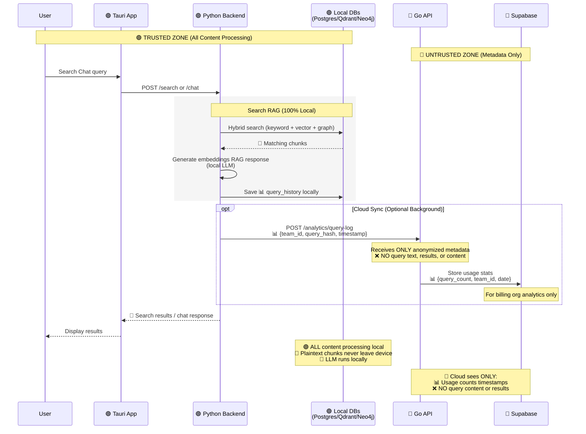

**Security Properties:**
- 🟢 Search and RAG processing identical to standalone (100% local)
- 📊 Optional usage telemetry (anonymized, no content)
- 🔑 Query text and results NEVER sent to cloud
- 🚫 **Zero-Knowledge Boundary:** Cloud cannot see queries or search results
- 📈 Usage stats for billing purposes only

**What Cloud Sees:**
- ✅ Number of queries per team
- ✅ Timestamps and usage patterns
- ❌ **Never:** Query text, search results, document content

---

## 7. Document Download Decryption

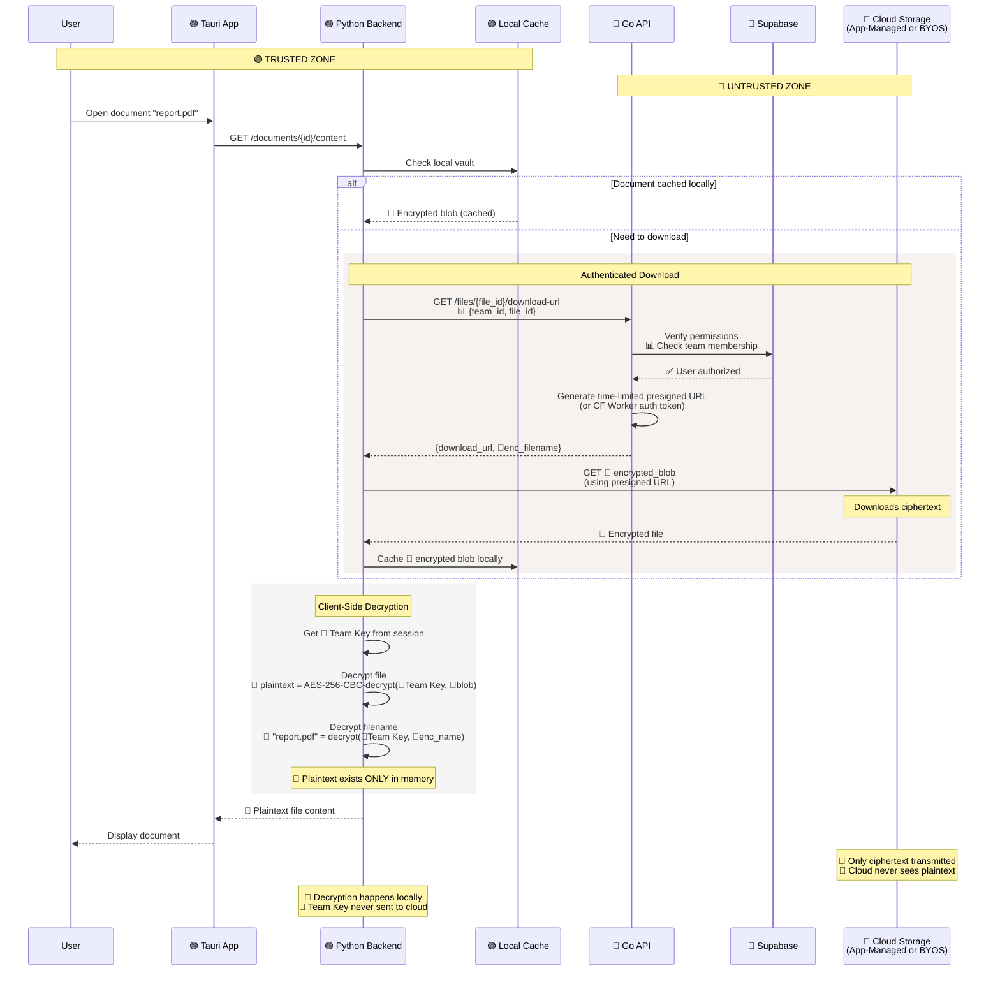

**Security Properties:**
- 🔐 Cloud storage serves only encrypted blobs
- 🔑 Decryption happens exclusively in local backend
- 🔑 Team key stays in local memory (never transmitted)
- 🔒 Presigned URLs are time-limited and permission-checked
- 🚫 **Zero-Knowledge Boundary:** Cloud cannot decrypt files

**Download Flow:**
1. 🔴 **Untrusted:** Download encrypted blob from cloud
2. 🟢 **Trusted:** Decrypt locally with team key
3. 📄 **Plaintext:** Exists only in local memory/cache

---

## 8. Share Link Creation Access

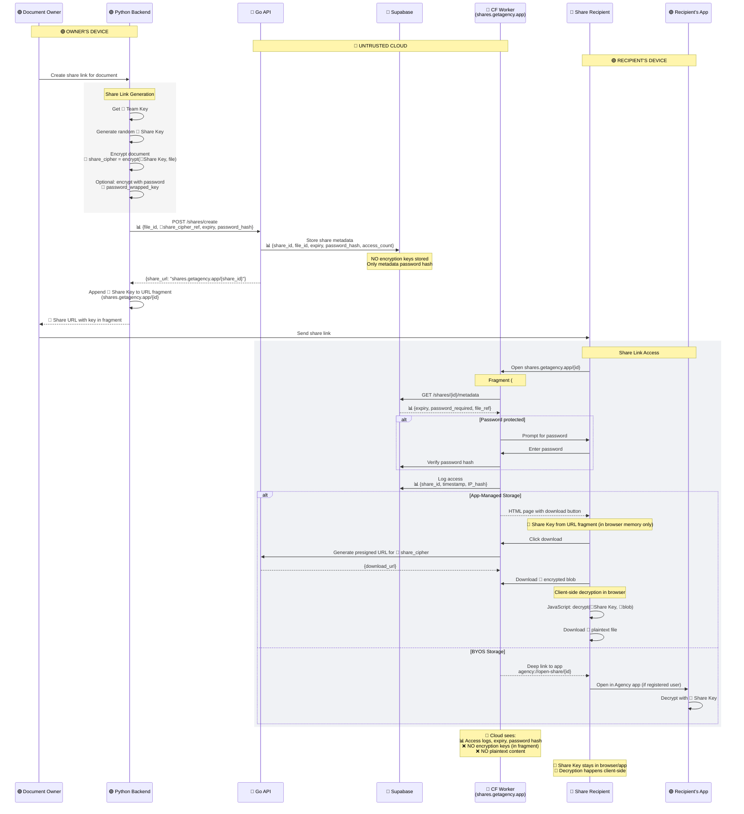

**Security Properties:**
- 🔑 Share key transmitted in URL fragment (never sent to server)
- 🔐 Document encrypted specifically for sharing (separate from team key)
- 🔒 Optional password protection (hashed, not stored plaintext)
- 📊 Access logs for audit trail
- 🚫 **Zero-Knowledge Boundary:** Cloud never sees share key or plaintext
- ⏰ Time-limited share links with expiry

**Share Link Security:**
- ✅ Share key in URL fragment (client-side only)
- ✅ Password protection available
- ✅ Access logging and revocation
- ✅ Client-side decryption (browser or app)
- ❌ Cloud cannot decrypt shared content

**BYOS vs App-Managed:**
- **App-Managed:** Browser decryption via JavaScript
- **BYOS:** Deep link to app (registered users only)

---

## 9. Team Creation Key Distribution

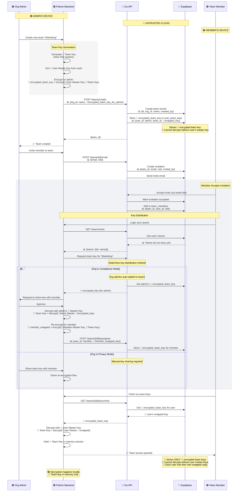

**Security Properties:**
- 🔑 Team key generated locally by admin
- 🔐 Team key encrypted separately for each team member (wrapped with their master key)
- 🔑 Cloud stores only encrypted team keys (per-user wrapped)
- 🚫 **Zero-Knowledge Boundary:** Cloud cannot decrypt team keys
- 🔒 Privacy Mode: Manual key sharing required
- 🔒 Compliance Mode: Org admins auto-granted access

**Key Distribution Model:**
- ✅ Each user gets their own encrypted copy of team key
- ✅ Wrapped with user's master key (unique per user)
- ✅ Cloud cannot unwrap or access team keys
- ✅ Supports key rotation and revocation

**Privacy vs Compliance Mode:**
- **Privacy Mode:** Org admins not auto-added to teams, manual key sharing
- **Compliance Mode:** Org admins granted access to all team keys for audit purposes

---

## 10. TEE Offload/Load Flow

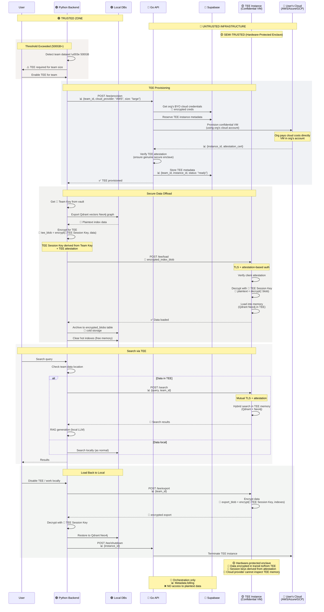

**Security Properties:**
- 🟡 TEE provides hardware-level confidentiality (encrypted memory)
- 🔑 Session keys derived from TEE attestation + team key
- 🔐 Data encrypted during transit to/from TEE
- 🔒 Mutual TLS + attestation for all TEE communication
- 🚫 **Zero-Knowledge Boundary:** Cloud provider infrastructure cannot access TEE memory
- 🏢 User's cloud account hosts TEE (direct cost control)

**TEE Guarantees:**
- ✅ Hardware-protected confidential computing
- ✅ Attestation proves genuine secure enclave
- ✅ Cloud provider (AWS/Azure/GCP) cannot inspect TEE memory
- ✅ Encrypted communication channels only
- ✅ Data processed in hardware-isolated environment

**Workflow:**
1. **Provision:** Create TEE in user's cloud account
2. **Offload:** Encrypt and transfer data to TEE
3. **Process:** Search/compute runs in TEE enclave
4. **Load:** Transfer data back and shutdown TEE

**When TEE Required:**
- ⚠️ 50GB: Warning threshold
- 📊 100GB: Strong recommendation
- 🚫 500GB: Enforced requirement (local hardware insufficient)

---

## Summary: Zero-Knowledge Properties Across All Flows

| Flow | Trusted Zone | Untrusted Zone | What Cloud Sees | What Cloud CANNOT See |
|------|--------------|----------------|-----------------|----------------------|
| **Standalone Mode** | 🟢 User's device (all processing) | ❌ N/A (fully offline) | ❌ Nothing | ❌ N/A |
| **App-Managed Upload** | 🟢 Local encryption | 🔴 S3, Go API, Supabase | 🔐 Encrypted blob, 🔐 encrypted filename, 📊 metadata | 📄 Plaintext content, 📄 plaintext filename, 🔑 team key |
| **BYOS Upload** | 🟢 Local encryption | 🔴 User's bucket, Go API | 🔐 Encrypted blob, 🔐 encrypted filename, 🔐 encrypted credentials | 📄 Plaintext content, 🔑 credentials, 🔑 team key |
| **Search Chat** | 🟢 All search LLM processing | 🔴 Optional analytics | 📊 Query counts, timestamps | 📄 Query text, 📄 results, 📄 document content |
| **Download** | 🟢 Client-side decryption | 🔴 S3 serves ciphertext | 🔐 Encrypted blob download | 📄 Plaintext content, 🔑 decryption keys |
| **Share Links** | 🟢 Encryption decryption | 🔴 Share worker, metadata | 📊 Access logs, expiry, password hash | 🔑 Share key (in URL fragment), 📄 plaintext content |
| **Team Keys** | 🟢 Key generation unwrapping | 🔴 Supabase | 🔐 Encrypted team keys (per-user wrapped) | 🔑 Team key plaintext, 🔑 user master keys |
| **TEE Processing** | 🟢 Local backend, 🟡 TEE enclave | 🔴 Cloud infrastructure | 📊 TEE metadata, billing | 📄 Data in TEE memory (hardware-protected) |

---

## Key Takeaways

1. **🔑 Keys Never Leave Trusted Zones**
   - User master keys generated stored locally only
   - Team keys encrypted per-user before cloud storage
   - Share keys transmitted in URL fragments (client-only)

2. **🔐 Encryption Before Transmission**
   - All files encrypted with team keys before upload
   - Filenames encrypted and hex-encoded
   - BYOS credentials encrypted with org keys

3. **🚫 Zero-Knowledge Cloud**
   - Cloud sees only: encrypted blobs, encrypted filenames, metadata
   - Cloud cannot decrypt without keys (which it never receives)
   - Search and RAG processing stays local

4. **🟡 TEE Semi-Trusted Model**
   - Hardware-protected enclaves for large datasets
   - Attestation-based trust model
   - Cloud infrastructure cannot inspect TEE memory
   - User controls cloud account costs

5. **📊 Minimal Metadata Exposure**
   - Cloud receives only necessary operational metadata
   - Anonymized analytics (no query content)
   - Audit logs respect privacy vs compliance mode

6. **🔒 Defense in Depth**
   - Multiple encryption layers (transport + storage)
   - Mutual TLS + attestation for TEE
   - Time-limited presigned URLs
   - Permission checks before key distribution
